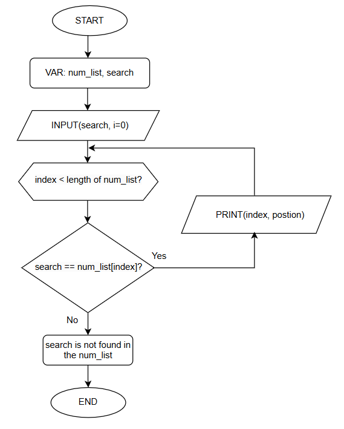
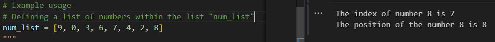

# Linear Search
A *Searching algorithm* used to find an element in a list. It works by checking each element in the list one by one from the start index until the nth index it finds the target element or reaches the end of the list. It's the basic version of any searching algorithm.

## Algorithm Linear Search
```language
START
DEFINE FUNCTION find_num_postion(num_list, search):
    FOR index FROM 0 TO LENGTH(num_list) - 1:
        IF search == num_list[index]:
            PRINT "The index of number", search, "is", index
            PRINT "The position of the number", search, "is", index + 1
            RETURN
    END FOR

    IF search NOT IN num_list:
        PRINT "Enter a proper value"
    END IF

DEFINE num_list AS [9, 0, 3, 6, 7, 4, 2, 8]
PROMPT user TO ENTER a number AND STORE IT IN search
CALL find_num_postion(num_list, search)
END
```
## FLowchart Linear Search


## Edge cases Linear Search
The search key found in the last posiiton of the list


The search key found in the first posiiton of the list


The search key never found in the list
