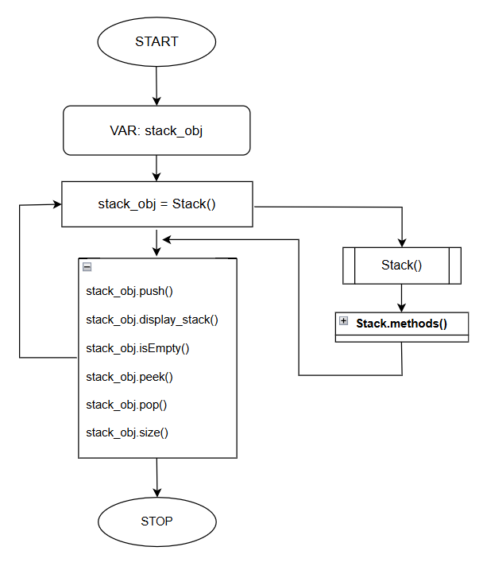
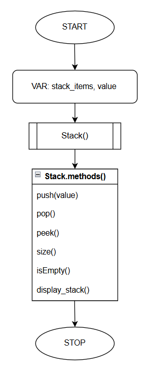

# Stack

in _Data Structure_ is an efficient way to store any data in a structured way that follows Last In First Out (LIFO)/ First In Last Out (FILO) approach with the data that is put into the Stack. And stack operations include,

- `push()`
- `pop()`
- `peek()`
- `isEmpty()`
- `size()`

## Algorithm of Stack Operations

```language
START
CLASS Stack():
    INITIALIZE stack_items

    push(value):
    APPEND value to stack_items.

    pop():
        IF stack is empty:
            PRINT "Stack is empty. Cannot pop element."
        ELSE:
            Remove the last element in the stack_items.
        END IF

    peek():
        IF stack is empty:
            PRINT "Stack is empty. Nothing to peek."
        ELSE:
            Return the last element in the stack_items.
        END IF

    size():
        Return the length of the stack_items.

    isEmpty():
        IF length of stack_items == 0:
            Return TRUE
        ELSE:
            Return FALSE
        END IF

    display_stack():
        IF stack is empty:
            PRINT "Stack is empty."
        ELSE:
            FOR value in stack_items:
                PRINT value
        END IF

main():
    stack_obj = Stack()
    stack_obj.push(2)
    stack_obj.push(4)
    stack_obj.push(6)
    stack_obj.push(8)

    stack_obj.display_stack()

    PRINT("Is stack empty?: ", stack_obj.isEmpty())

    PRINT("Top element: ", stack_obj.peek())

    PRINT("Popped element: ", stack_obj.pop())

    stack_obj.display_stack()

    PRINT("\nSize of the stack:", stack_obj.size())

END
```

## Flowchart of Stack Operations




